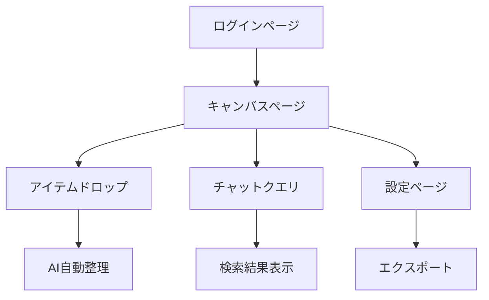

## 1. 製品概要
Nebulaは、AIが自動で整理する無限キャンバス型の日常生活管理ツールです。テキスト、画像、リンクをただ放り込むだけで、AIが意味的に類似したコンテンツを自動的にクラスタリングして整理します。

日々の情報を手間なく整理したい学生、主婦、ビジネスパーソンなど、組織化に苦労する一般ユーザー向けに設計されています。

## 2. コア機能

### 2.1 ユーザーロール
| ロール | 登録方法 | コア権限 |
|------|----------|----------|
| 無料ユーザー | メールアドレス登録 | 基本機能使用、月間100アイテムまで |
| プレミアムユーザー | 支払いアップグレード | 無制限アイテム、高度なAI機能、エクスポート機能 |

### 2.2 機能モジュール
Nebulaの要件は以下の主要ページで構成されます：
1. **キャンバスページ**: 無限キャンバス、AI自動整理、チャットインターフェース
2. **ログインページ**: ユーザー認証、アカウント作成
3. **設定ページ**: アカウント管理、エクスポート機能、AI設定

### 2.3 ページ詳細
| ページ名 | モジュール名 | 機能説明 |
|----------|-------------|----------|
| キャンバスページ | ユニバーサルドロップゾーン | テキスト、画像、URLをドラッグ&ドロップで簡単に入力 |
| キャンバスページ | AI自動整理 | 意味的に類似したアイテムを自動的にクラスタリング（買い物、旅行、仕事など） |
| キャンバスページ | チャットインターフェース | 「買い物リストはどこ？」などの自然言語クエリでキャンバスコンテンツを検索 |
| キャンバスページ | 無限キャンバス | ズームイン/アウト、パン操作、自由な配置 |
| ログインページ | ユーザー認証 | メールアドレスとパスワードでのログイン機能 |
| ログインページ | アカウント作成 | 新規ユーザー登録、メール確認 |
| 設定ページ | アカウント管理 | プロフィール編集、パスワード変更 |
| 設定ページ | エクスポート機能 | キャンバスコンテンツのPDF/画像エクスポート |
| 設定ページ | AI設定 | クラスタリングの感度調整、言語設定 |

## 3. コアプロセス

### 一般ユーザーフロー
1. ユーザーはログインページでアカウントを作成またはログイン
2. キャンバスページに移動し、テキスト、画像、リンクをドロップ
3. AIが自動的にコンテンツを分析し、意味的に類似したアイテムをグループ化
4. ユーザーはチャットインターフェースで自然言語で質問し、必要な情報を見つける
5. 設定ページでアカウント管理やエクスポートを実行

## 4. ユーザーインターフェースデザイン

### 4.1 デザインスタイル
- **プライマリカラー**: 純白（#FFFFFF）、ライトグレー（#F5F5F5）
- **アクセントカラー**: スカイブルー（#0EA5E9）、エメラルドグリーン（#10B981）
- **ボタンスタイル**: 角丸（8px）、シャドウ効果、ホバーアニメーション
- **フォント**: システムフォント（-apple-system, BlinkMacSystemFont）、サイズ14-16px
- **レイアウトスタイル**: カードベース、ミニマリスト、十分な余白
- **アイコンスタイル**: アウトラインアイコン、シンプルで直感的なデザイン

### 4.2 ページデザイン概要
| ページ名 | モジュール名 | UI要素 |
|----------|-------------|----------|
| キャンバスページ | 無限キャンバス | 白い背景、グリッドドット、スムーズなズームとパン操作、右下にチャットボタン |
| キャンバスページ | AIクラスタ | カラフルなバブル表示、自動的にグループ化されたアイテム、ドラッグで移動可能 |
| キャンバスページ | チャットインターフェース | スライドアップパネル、自然言語入力フィールド、会話履歴表示 |
| ログインページ | 認証フォーム | 中央配置、角丸入力フィールド、大きなログインボタン、最小限のデザイン |
| 設定ページ | 設定メニュー | リスト形式、明確なセクション分け、トグルスイッチ、エクスポートボタン |

### 4.3 レスポンシブデザイン
デスクトップファーストのアプローチで設計し、モバイルデバイスにも適応。タッチ操作を最適化し、スマートフォンではシングルカラムレイアウトを採用。