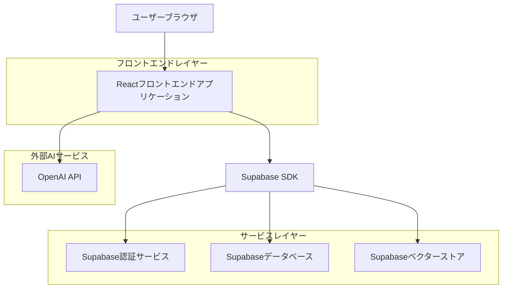
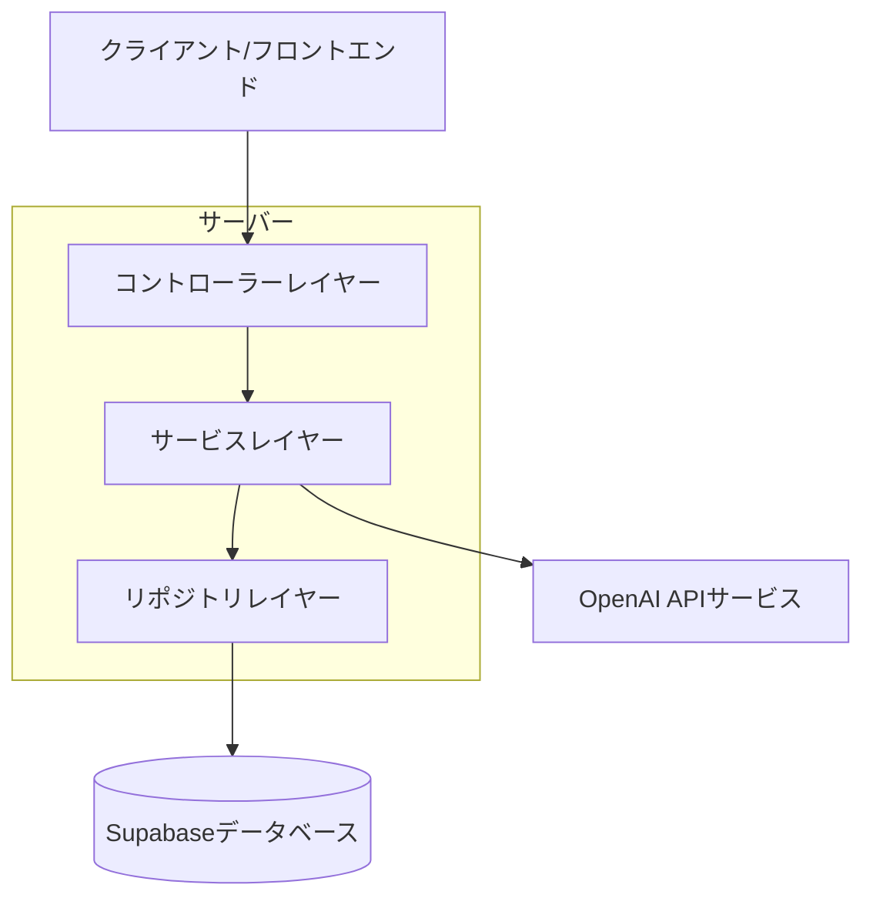
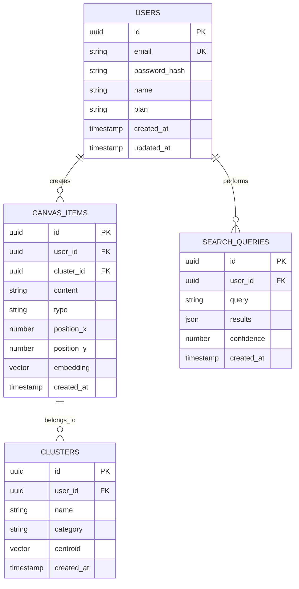

## 1. アーキテクチャ設計



## 2. 技術スタック
- **フロントエンド**: React@18 + TypeScript + Tailwind CSS@3 + Vite
- **初期化ツール**: vite-init
- **バックエンド**: Supabase（認証、PostgreSQL、ベクターストレージ）
- **AI統合**: OpenAI API（埋め込み生成、自然言語処理）

## 3. ルート定義
| ルート | 目的 |
|-------|------|
| / | キャンバスページ、メインの作業スペース |
| /login | ログインページ、ユーザー認証 |
| /settings | 設定ページ、アカウント管理とエクスポート機能 |

## 4. API定義

### 4.1 コアAPI

**キャンバスアイテム管理**
```
POST /api/canvas/items
```

リクエスト:
| パラメータ名 | パラメータ型 | 必須 | 説明 |
|-----------|-------------|------|------|
| content | string | true | テキストコンテンツ |
| type | string | true | アイテムタイプ（text, image, url） |
| position_x | number | false | X座標位置 |
| position_y | number | false | Y座標位置 |

レスポンス:
| パラメータ名 | パラメータ型 | 説明 |
|-----------|-------------|------|
| id | string | アイテム固有ID |
| cluster_id | string | AIによるクラスタリンググループID |
| embedding | array | ベクター埋め込みデータ |

**AIクラスタリングクエリ**
```
POST /api/ai/cluster
```

リクエスト:
| パラメータ名 | パラメータ型 | 必須 | 説明 |
|-----------|-------------|------|------|
| query | string | true | 自然言語クエリ |

レスポンス:
| パラメータ名 | パラメータ型 | 説明 |
|-----------|-------------|------|
| results | array | 関連するアイテムの配列 |
| confidence | number | マッチング信頼度スコア |

## 5. サーバーアーキテクチャ図



## 6. データモデル

### 6.1 データモデル定義



### 6.2 データ定義言語

**ユーザーテーブル（users）**
```sql
-- テーブル作成
CREATE TABLE users (
    id UUID PRIMARY KEY DEFAULT gen_random_uuid(),
    email VARCHAR(255) UNIQUE NOT NULL,
    password_hash VARCHAR(255) NOT NULL,
    name VARCHAR(100) NOT NULL,
    plan VARCHAR(20) DEFAULT 'free' CHECK (plan IN ('free', 'premium')),
    created_at TIMESTAMP WITH TIME ZONE DEFAULT NOW(),
    updated_at TIMESTAMP WITH TIME ZONE DEFAULT NOW()
);

-- インデックス作成
CREATE INDEX idx_users_email ON users(email);
CREATE INDEX idx_users_plan ON users(plan);
```

**キャンバスアイテムテーブル（canvas_items）**
```sql
-- テーブル作成
CREATE TABLE canvas_items (
    id UUID PRIMARY KEY DEFAULT gen_random_uuid(),
    user_id UUID NOT NULL REFERENCES users(id) ON DELETE CASCADE,
    cluster_id UUID REFERENCES clusters(id),
    content TEXT NOT NULL,
    type VARCHAR(20) CHECK (type IN ('text', 'image', 'url')),
    position_x INTEGER DEFAULT 0,
    position_y INTEGER DEFAULT 0,
    embedding vector(1536),
    created_at TIMESTAMP WITH TIME ZONE DEFAULT NOW(),
    updated_at TIMESTAMP WITH TIME ZONE DEFAULT NOW()
);

-- ベクター拡張機能を有効化
CREATE EXTENSION IF NOT EXISTS vector;

-- インデックス作成
CREATE INDEX idx_canvas_items_user_id ON canvas_items(user_id);
CREATE INDEX idx_canvas_items_cluster_id ON canvas_items(cluster_id);
CREATE INDEX idx_canvas_items_embedding ON canvas_items USING ivfflat (embedding vector_cosine_ops);

-- アクセス権限
GRANT SELECT ON canvas_items TO anon;
GRANT ALL PRIVILEGES ON canvas_items TO authenticated;
```

**クラスターテーブル（clusters）**
```sql
-- テーブル作成
CREATE TABLE clusters (
    id UUID PRIMARY KEY DEFAULT gen_random_uuid(),
    user_id UUID NOT NULL REFERENCES users(id) ON DELETE CASCADE,
    name VARCHAR(255) NOT NULL,
    category VARCHAR(100),
    centroid vector(1536),
    created_at TIMESTAMP WITH TIME ZONE DEFAULT NOW(),
    updated_at TIMESTAMP WITH TIME ZONE DEFAULT NOW()
);

-- インデックス作成
CREATE INDEX idx_clusters_user_id ON clusters(user_id);
CREATE INDEX idx_clusters_category ON clusters(category);

-- アクセス権限
GRANT SELECT ON clusters TO anon;
GRANT ALL PRIVILEGES ON clusters TO authenticated;
```